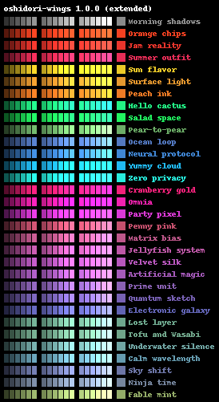

# Oshidori wings

**Oshidori wings** is an open source palette, which can be used in any desktop, mobile or web applications.
This repository also contains Python script for generating palette showcase, feel free to use it for your custom palettes as well.

The palette itself stored in JSON format and located in [src/palette.json](src/palette.json) - this file is used in palette generator.

Here is an example of what the palette generator produces:



## Requirements
This project uses Python 3 and pip3, so make sure that you have the latest versions of both tools.

## Installation
Download this project and the palette generator script is ready to use.
To install all the dependencies for this script, simply run the pip install command:
```
pip3 install -r requirements.txt
```
It will install all the dependencies from the requirements file.

## Quick start
In order to run the generator, use the following command:
```
python palette-generator/main.py
```
It will produce `dist/[palette_name].png` (regular palette file) and `dist/[palette_name]_ext.png` (the same palette but extended).

If you want to generate a palette file for your custom palette, just edit the [src/palette.json](src/palette.json) file and run the generator.

## Troubleshooting
If you get any troubles during the installation process you can open an [issue](https://github.com/oshidori-src/oshidori-wings/issues).

Got any questions? Feel free to ask them on Twitter [@oshidori_tech](https://twitter.com/oshidori_tech) or by email [support@oshidori.co](mailto:support@oshidori.co).

## Contributing
Unfortunately, right now, we do not accept any pull requests in [this](https://github.com/oshidori-src/oshidori-wings) project.
But hey! This is an open source project, so you can always make a fork of it.
Also, if you have a really important feature request, you can always open an [issue](https://github.com/oshidori-src/oshidori-wings/issues) for this.

## License
This project is licensed under the Apache License, Version 2.0, please see the [LICENSE](https://github.com/oshidori-src/oshidori-wings/blob/master/LICENSE) file for details.

Copyright &copy; 2019 Oshidori LLC [@oshidori_tech](https://twitter.com/oshidori_tech) [support@oshidori.co](mailto:support@oshidori.co)
